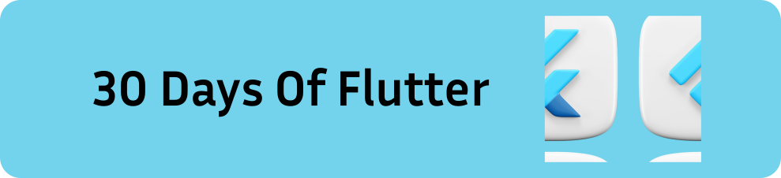

# 30 Days of Flutter 

 

💛💛💛 HAPPY CODING 💛💛💛
| # Day |                                                                       Topics                                                                        |
| ----- | :-------------------------------------------------------------------------------------------------------------------------------------------------: |
| 01    |                                                             [Introduction](./day1/README.md)                                                        |
| 02    |                                                [stateless and stateful , gesture](./day2/README.md)                                                 |
| 03    |                                                [Navigation , Input forms](./day3/README.md)                                                         |
| 04    |                                                [Scrolling](./day4/README.md)                                                                        |
| 05    |                                                [State Management](./day5/README.md)                                                                 |
| 06    |                                                [working on the project - shoe seeling mobile application](./day9/README.md)                         |
| 07    |                                                [working on the project - shoe seeling mobile application](./day9/README.md)                         |
| 08    |                                                [working on the project - shoe seeling mobile application](./day9/README.md)                         |
| 09    |                                                [Completed the project - shoe seeling mobile application](./day9/README.md)                          |
| 10    |                                                [REST API - Networking](./day10/README.md)                                                           |
| 11    |                                                Animation                                                                                            |
| 12    |                                                [Shared Prefrences](./day12/README.md)                                                               |
| 13    |                                                [Camera](./day13/README.md)                                                               |
| 14    |                                              Calender                                                               |
| 15    |                                              [Music App Project](./day16/README.md)                      |
| 16    |                                              [Music App Project](./day16/README.md)                      |
| 17    |                                              [completion of Music App Project](./day17/README.md)                      |
| 18    |                                              [SQL learnings](./day18/README.md)                      |
| 19    |                                              [Responsive and Adaptive](./day19/README.md)                      |
| 19    |                                              [Bloc State Management](./day20/README.md)                      |

NOTE : This is a work in progress. I will keep on adding the topics and resources as I learn them. 
