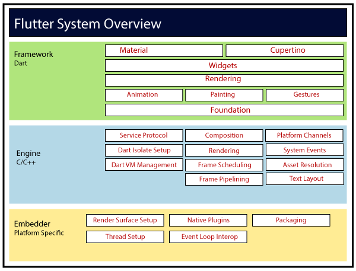
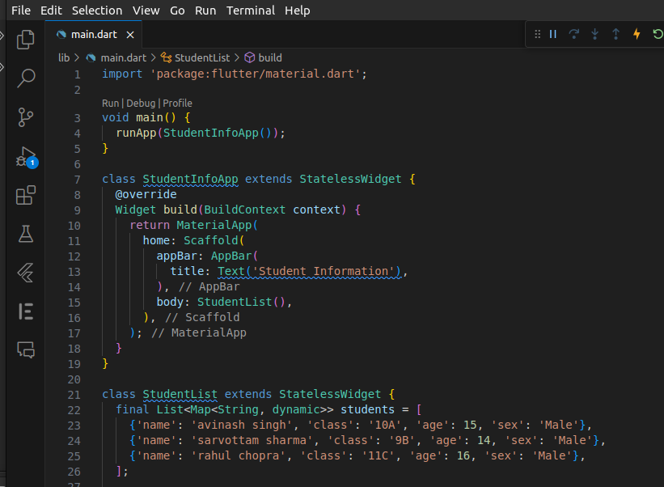
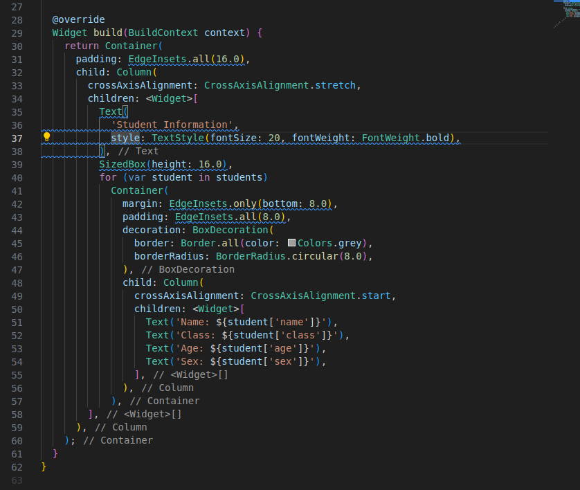

## Day 1: Introduction

### What is Flutter?

Flutter is Google’s UI toolkit for building beautiful, natively compiled applications for mobile, web, and desktop from a single codebase.


### Why Flutter?

Flutter is an open-source UI software development kit created by Google. It is used to develop applications for Android, iOS, Linux, Mac, Windows, Google Fuchsia, and the web from a single codebase. The first version of Flutter was known as codename "Sky" and ran on the Android operating system. It was unveiled at the 2015 Dart developer summit, with the stated intent of being able to render consistently at 120 frames per second.

### Flutter Architecture



### Flutter Installation

#### Windows

1. Download the following installation bundle to get the latest stable release of the Flutter SDK:

[flutter_windows_2.2.3-stable.zip](https://storage.googleapis.com/flutter_infra/releases/stable/windows/flutter_windows_2.2.3-stable.zip)

2. Extract the zip file and place the contained flutter in the desired installation location for the Flutter SDK (for example, C:\src\flutter; do not install Flutter in a directory like C:\Program Files\ that requires elevated privileges).

3. Locate the file flutter_console.bat inside the flutter directory. Start it by double-clicking.

4. Update your path. If you wish to run Flutter commands in the regular Windows console, take these steps to add Flutter to the PATH environment variable:

From the Start search bar, enter ‘env’ and select Edit environment variables for your account.

Under User variables check if there is an entry called Path:

If the entry exists, append the full path to flutter\bin using ; as a separator from existing values.

If the entry doesn’t exist, create a new user variable named Path with the full path to flutter\bin as its value.

You have to close and reopen any existing console windows for these changes to take effect.

#### Mac

1. Download the following installation bundle to get the latest stable release of the Flutter SDK:

[flutter_macos_2.2.3-stable.zip](https://storage.googleapis.com/flutter_infra/releases/stable/macos/flutter_macos_2.2.3-stable.zip)

2. Extract the zip file and place the contained flutter in the desired installation location for the Flutter SDK (for example, /usr/local/flutter; do not install Flutter in a directory like /Users/<your username>/Documents that requires elevated privileges).

3. If you don’t want to install a fixed version of the installation bundle, you can skip steps 1 and 2. Instead, get the source code from the Flutter repo on GitHub with the following command:

`git clone

4. Update your path. You can update your PATH variable for the current session at the command line, as shown in Get the Flutter SDK. You’ll probably want to update this variable permanently, so you can run flutter commands in any terminal session.

The steps for modifying this variable permanently for all terminal sessions are machine-specific. Typically you add a line to a file that is executed whenever you open a new window. For example:

Determine the directory where you placed the Flutter SDK. You need this in Step 3.

Open (or create) the rc file for your shell. Typing echo $SHELL in your Terminal tells you which shell you’re using. If you’re using Bash, edit $HOME/.bash_profile or $HOME/.bashrc. If you’re using Z shell, edit $HOME/.zshrc. If you’re using a different shell, the file path and filename will be different on your machine.

Add the following line and change [PATH_TO_FLUTTER_GIT_DIRECTORY] to be the path where you cloned Flutter’s git repo:

`export PATH="$PATH:[PATH_TO_FLUTTER_GIT_DIRECTORY]/flutter/bin"`

Run source $HOME/.<rc file> to refresh the current window, or open a new terminal window to automatically source the file.

Verify that the flutter/bin directory is now in your PATH by running:

`echo $PATH`

Verify that the flutter command is available by running:

`which flutter`

#### Linux

1. Download the following installation bundle to get the latest stable release of the Flutter SDK:

[flutter_linux_2.2.3-stable.tar.xz](https://storage.googleapis.com/flutter_infra/releases/stable/linux/flutter_linux_2.2.3-stable.tar.xz)

2. Extract the file in the desired location, for example:

`cd ~/development`

`tar xf ~/Downloads/flutter_linux_2.2.3-stable.tar.xz`

3. If you don’t want to install a fixed version of the installation bundle, you can skip steps 1 and 2. Instead, get the source code from the Flutter repo on GitHub with the following command:

`git clone

4. Update your path. You can update your PATH variable for the current session at the command line, as shown in Get the Flutter SDK. You’ll probably want to update this variable permanently, so you can run flutter commands in any terminal session.

The steps for modifying this variable permanently for all terminal sessions are machine-specific. Typically you add a line to a file that is executed whenever you open a new window. For example:

Determine the directory where you placed the Flutter SDK. You need this in Step 3.

Open (or create) the rc file for your shell. Typing echo $SHELL in your Terminal tells you which shell you’re using. If you’re using Bash, edit $HOME/.bash_profile or $HOME/.bashrc. If you’re using Z shell, edit $HOME/.zshrc. If you’re using a different shell, the file path and filename will be different on your machine.

Add the following line and change [PATH_TO_FLUTTER_GIT_DIRECTORY] to be the path where you cloned Flutter’s git repo:

`export PATH="$PATH:[PATH_TO_FLUTTER_GIT_DIRECTORY]/flutter/bin"`

Run source $HOME/.<rc file> to refresh the current window, or open a new terminal window to automatically source the file.

Verify that the flutter/bin directory is now in your PATH by running:

`echo $PATH`

Verify that the flutter command is available by running:

`which flutter`

### Flutter Doctor

Run the following command to see if there are any dependencies you need to install to complete the setup (for verbose output, add the -v flag):

`flutter doctor`

This command checks your environment and displays a report to the terminal window. The Dart SDK is bundled with Flutter; it is not necessary to install Dart separately. Check the output carefully for other software you might need to install or further tasks to perform (shown in bold text).

For example:

```
[-] Android toolchain - develop for Android devices
    • Android SDK at /Users/obiwan/Library/Android/sdk
    ✗ Android SDK is missing command line tools; download from https://goo.gl/XxQghQ
    • Try re-installing or updating your Android SDK,
      visit https://flutter.dev/docs/get-started/install/macos#android-setup for detailed instructions.
```

Some of the dependencies that the `flutter doctor` command checks for can be installed using the `flutter` command. For example, `flutter doctor` might report that it’s missing the Android SDK Platform tools, which are required for Flutter development. To install these tools, run the following command:


`flutter doctor --android-licenses`

This command opens a verbose output and asks for confirmation to install the Android licenses. Once you’ve reviewed the licenses, you can accept them all by entering `y` when prompted.

### Flutter Create

The `flutter create` command is used to create a new Flutter project. The `flutter create` command has several options to help you customize your new project. To see a list of the available options, run:

`flutter create --help`

### Flutter Run

The `flutter run` command compiles the Flutter app and starts it on a device. For example, to run your Flutter app on a Chrome browser, run the following command:

`flutter run -d chrome` 

# Day 1 : use layout widgets like( Container, Column, Row) and Text widget
<br>

## Notes:

### Container

A convenience widget that combines common painting, positioning, and sizing widgets.

A container first surrounds the child with padding (inflated by any borders present in the decoration) and then applies additional constraints to the padded extent (incorporating the width and height as constraints, if either is non-null). The container is then surrounded by additional empty space described from the margin.

During painting, the container first applies the given transform, then paints decorations, if any, then paints the child, and finally paints foreground decorations, if any.

### Column

A widget that displays its children in a vertical array.

To cause a child to expand to fill the available vertical space, wrap the child in an Expanded widget.

To cause a child to expand to fill the available horizontal space, wrap the child in an Expanded widget.

If you only have one child, then consider using Align or Center to position the child.

### Row

A widget that displays its children in a horizontal array.

To cause a child to expand to fill the available horizontal space, wrap the child in an Expanded widget.

If you only have one child, then consider using Align or Center to position the child.

### Text

A run of text with a single style.

The Text widget displays a string of text with single style. The string might break across multiple lines or might all be displayed on the same line depending on the layout constraints.

The style argument is optional. When omitted, the text will use the style from the closest enclosing DefaultTextStyle. If the given style's TextStyle.inherit property is true (the default), the given style will be merged with the closest enclosing DefaultTextStyle. This merging behavior is useful, for example, to make the text bold while using the default font family and size.

To display text that uses multiple styles (e.g., a paragraph with some bold words), use RichText.

## Code: [click to see code](/day1/code)


here is method to run these code

1. download `main.dart` file and save it in your computer
2. open terminal and go to the directory where you saved the file
3. run `flutter create .` command in terminal
4. now inside the lib folder replace the main.dart file with the file you downloaded
5. run `flutter run` command in terminal


## Output:




