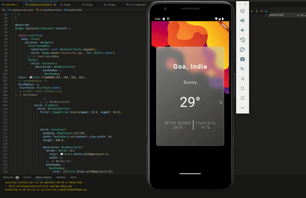

#  #Day10 of  #30DaysOfCode  ˗ˏˋ 📚 ☕︎ 🎧 ⚯ 💻 ˎˊ˗ 

Here's what I have learned:   
✅ REST Protocol  
✅ Fetch data from the internet,  
✅ Displaying on using UI  
✅ JSON and serialization  

 resourses :https://docs.flutter.dev/data-and-backend/networking

## Code: [click to see code for APP](/day10/code/app/) 📋
 
 