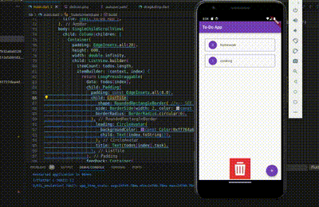

#  #Day2 of  #30DaysOfCode 

- Understanding the basic structure of a Flutter app
-  Widgets: `Stateless` vs `Stateful`
Managing state with `setState()`  
  resources : https://docs.flutter.dev/ui/interactivity

- Adding interactivity   by using `onTapDown`, `Long press`, `pan` with  `GestureDetector`
- tried ` LongPressDraggable`    
 resources :
- https://docs.flutter.dev/ui/interactivity/gestures
- https://docs.flutter.dev/cookbook/effects/drag-a-widget

## Code: [click to see code](/day2/code/)

# Usage

1. create a new flutter project with `flutter create myapp`
2. replace main.dart inside `lib` folder  file with provided [main.dart](/day2/code/app/) file.

