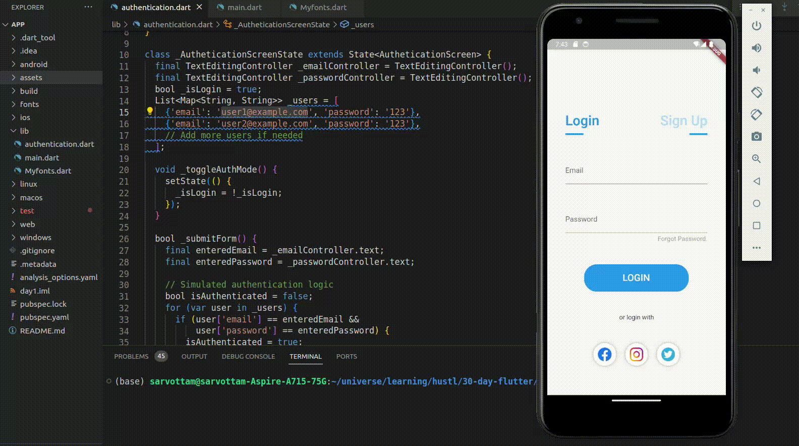

#  #Day3 of  #30DaysOfCode  ˗ˏˋ 📚 ☕︎ 🎧 ⚯ 💻 ˎˊ˗ 

## **navigation**

- [overview in( router,  named route,  navigator)](https://docs.flutter.dev/ui/navigation)
- [Navigate to a new screen and back](https://docs.flutter.dev/cookbook/navigation/navigation-basics)
- [Send data to a new screen](https://docs.flutter.dev/cookbook/navigation/passing-data)
- [Return data from a screen](https://docs.flutter.dev/cookbook/navigation/returning-data)

resources:  https://docs.flutter.dev/ui/navigation  

## **Input & output**

- [Create and style a text field](https://docs.flutter.dev/cookbook/forms/text-input)
- [Retrieve the value of a text field](https://docs.flutter.dev/cookbook/forms/retrieve-input)
- [Handle changes to a text field](https://docs.flutter.dev/cookbook/forms/text-field-changes)
- [Manage focus in text fields](https://docs.flutter.dev/cookbook/forms/focus)
- [Build a form with validation](https://docs.flutter.dev/cookbook/forms/validation)

resources :https://docs.flutter.dev/cookbook/forms/text-input

# 👩🏻‍💻 Created simple project to understand the navigation in flutter and how to pass data between screens and also how to use the input and output in flutter. 
## Code: [click to see code](/day3/code/) 📋

## Usage

1. create a new flutter project with `flutter create myapp`
2. replace main.dart inside your `lib` folder with provided [main.dart](/day2/code/app/) file.

