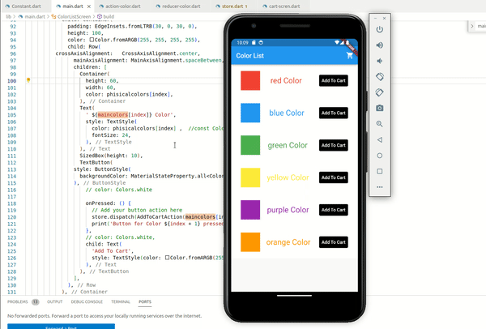

#  #Day5 of  #30DaysOfCode  ˗ˏˋ 📚 ☕︎ 🎧 ⚯ 💻 ˎˊ˗ 

## **State Management**

✅  Simple app state management 
✅  use of provider package to build app 
✅  learned Redux architecture  
✅  use of Redux to build app 
 

resources:  https://docs.flutter.dev/data-and-backend/state-mgmt/simple  
resources to learn Redux: https://docs.flutter.dev/data-and-backend/state-mgmt/options   
resources for other state management: https://docs.flutter.dev/data-and-backend/state-mgmt/options

## Code: [click to see code for APP](/day5/code/) 📋
 
 
 

